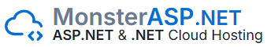

# 📝 Task / CR / Bug Management System

A web-based **Task, Change Request (CR), and Bug Management System** built with **ASP.NET Core MVC (.NET 8)**, using **MS SQL Server or MySQL** as the database.

This system helps teams manage tasks, track bugs, handle change requests, and organize projects efficiently.


## 📑 Table of Contents

1. [✨ Features](#-features)
2. [🏛 Master Modules](#-master-modules)
3. [⚡ Transaction Modules](#-transaction-modules)
4. [🗂 Module Hierarchy](#-module-hierarchy)
5. [🛠 Technology Stack](#-technology-stack)
6. [🚀 Project Setup](#-project-setup)
7. [💾 Database Migrations](#-database-migrations)
8. [▶️ Running the Project](#-running-the-project)
9. [🐛 GitHub Issues & Contribution](#-github-issues--contribution)
10. [📄 License](#-license)

## ✨ Features

- 👤 User authentication and authorization with roles & permissions.
- 🏢 Client and project management.
- 🐞 Task, Change Request, and Bug tracking with status, severity, and reporter.
- 📆 Sprint and backlog management.
- 🧩 Modular system design with configurable menus and settings.
- 📊 Full audit and tracking for project activities.

## 🏛 Master Modules

| Module                      | Description                                                         |
| --------------------------- | ------------------------------------------------------------------- |
| 👤 User                     | System users who can create or manage tasks.                        |
| 🔑 User Roles & Permissions | Define roles (Admin, Manager, Developer, Tester) and access rights. |
| 🏢 Client                   | Organizations or clients associated with projects.                  |
| 📁 Project                  | Projects under a client.                                            |
| 🧩 Module                   | Main functional modules of a project.                               |
| 🔹 SubModule                | Sub-divisions under each module.                                    |
| 📝 Reporter                 | Person reporting a task, bug, or CR.                                |
| ⚠️ Severity                 | Priority/impact of tasks/bugs (High, Medium, Low).                  |
| 🔄 Status                   | Current status of a task (Open, In Progress, Closed, etc.).         |
| 🗂 TaskType                  | Type of work (Task, Bug, CR).                                       |
| 📜 Menu                     | Configurable navigation menu items.                                 |
| ⚙️ Setting                  | Application or system-wide settings.                                |

## ⚡ Transaction Modules

| Module     | Description                          |
| ---------- | ------------------------------------ |
| 📋 Backlog | Manage pending tasks, CRs, and bugs. |
| 🏃 Sprint  | Plan, track, and close sprints.      |

## 🗂 Module Hierarchy

```
Master Modules
├─ User
├─ User Roles & Permissions
├─ Client
├─ Project
├─ Module
│  └─ SubModule
├─ Reporter
├─ Severity
├─ Status
├─ TaskType
├─ Menu
└─ Setting

Transaction Modules
├─ Backlog
└─ Sprint
```

💡 **Note:** Master modules define core entities. Transaction modules handle activities/records based on master data.

## 🛠 Technology Stack

- **Backend:** ASP.NET Core MVC (.NET 8)
- **Frontend:** Razor Views, Bootstrap (optional)
- **Database:** MS SQL Server or MySQL
- **ORM:** Entity Framework Core
- **Version Control:** Git & GitHub

## 🚀 Project Setup

1. Clone the repository:

```powershell
git clone https://github.com/Taskist/taskist.git
cd Taskist
```

2. Open the solution in **Visual Studio 2022+** or VS Code.

3. Restore NuGet packages:

```powershell
dotnet restore
```

## 💾 Database Migrations

**Run EF Core commands from the `Task.Data` folder**:

1. Open terminal/powershell in the `Task.Data` folder:

```powershell
cd Task.Data
```

2. Add a new migration:

```powershell
dotnet ef migrations add InitialCreate --startup-project ..\..\Presentation\Taskist.Web
```

3. Update the database:

```powershell
dotnet ef database update --startup-project ..\..\Presentation\Taskist.Web
```

4. Remove the last migration (if needed):

```powershell
dotnet ef migrations remove --startup-project ..\..\Presentation\Taskist.Web
```

**Tip:** Make sure your `appsettings.json` connection string in the Web project points to **SQL Server or MySQL**.

## ▶️ Running the Project

```powershell
cd Presentation\Taskist.Web
dotnet run
```

- Open your browser and navigate to `https://localhost:5001` (or the port shown in console).
- Admin user can be seeded in the database using initial migration or `SeedData` class.

## 🐛 GitHub Issues & Contribution

### Raising an Issue

1. Go to the [Issues](https://github.com/Taskist/taskist/issues) tab.
2. Click **New Issue**.
3. Provide:
   - **Title**
   - **Description**
   - **Steps to reproduce** (for bugs) or expected feature description

### Contribution Rules

- 🍴 Fork the repository.
- 🌿 Create a feature branch:

```powershell
git checkout -b feature/YourFeatureName
```

- 📝 Make changes and commit:

```powershell
git add .
git commit -m "Description of your changes"
```

- ⬆️ Push to your fork:

```powershell
git push origin feature/YourFeatureName
```

- 🔀 Create a **Pull Request** to the `main` branch.

**Code Guidelines**

- Follow C# naming conventions.
- Keep methods short and modular.
- Use Entity Framework migrations for DB changes.

## 📄 License

This project is licensed under the **MIT License** – see the [LICENSE](LICENSE) file for details.

## 💖 Open Source Sponsors & Partners

We gratefully acknowledge the generous support of the following providers who offer free licenses or services to our open-source project:

<table>
<tbody>
<tr>
<td>
    <a href="https://sentry.io/for/open-source/" target="_blank" title="Sentry – Free error tracking for open-source projects">
        
    </a>
</td>
<td>
    <a href="https://www.atlassian.com/software/confluence" target="_blank" title="Atlassian Confluence">
        
    </a>
 </td>
 <td>
    <a href="https://monsterasp.net" target="_blank" title="MonsterASP.Net">
        
    </a>
 </td>
 <td>
    <a href="https://www.atlassian.com/software/confluence" target="_blank" title="Atlassian Confluence">
        
    </a>
 </td>
</tr>
</tbody>
</table>

## 🌟 Support the Project

If you find **Taskist** helpful, please consider supporting it! ❤️
Your support helps keep the project growing and maintained.

### 🪙 Ways to Support

- ⭐ **Star this repository** on GitHub to show appreciation
- 🪙 **Share it** with other developers or teams
- ☕ **Buy Me a Coffee** to support ongoing development
<p>
  <a href="https://www.buymeacoffee.com/somaraj" target="_blank"></a>
</p>
